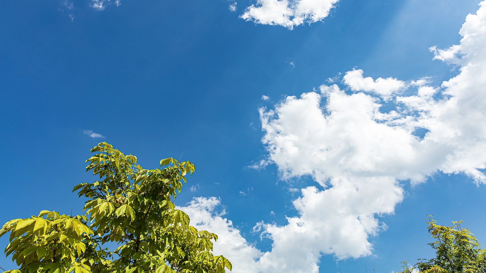
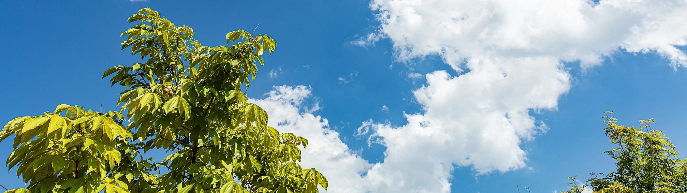
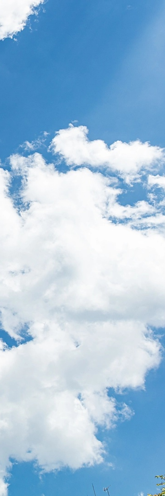

# ローカル23

## これは空です

これは空の写真です。

{: .scroll-img}

## これも空です

東京は、日本の政治・経済・文化の中心として発展し続けている都市です[^capital]。特に都心部では再開発が進み、新しい商業施設やオフィスビルが次々と誕生しています[^redevelopment]。

一方で、下町エリアには昔ながらの商店街や住宅街が残り、東京の多様な  魅力を感じられる場所として人気があります[^shitamachi]。また、近年は海外からの観光客が増え、街の国際色がさらに強まっています[^tourism]。

{: .scroll-img}

## これは木です

これは木の写真ですよ。

{: .scroll-img}

これは脚注付きの文章です[^1]

[^1]: これが脚注の内容

{: .mytable}
| A | B |
|---|---|
| 1 | 2 |

[^capital]: 東京は1869年に日本の首都となり、現在も行政機能の中心地となっている。
[^redevelopment]: 渋谷、虎ノ門、品川などで大規模な再開発が進行している。
[^shitamachi]: 浅草や谷中などは、昭和の雰囲気を残す下町として知られている。
[^tourism]: コロナ後の観光需要回復により、訪日外国人が急増している。

<dialog id="viewer">
  
</dialog>

